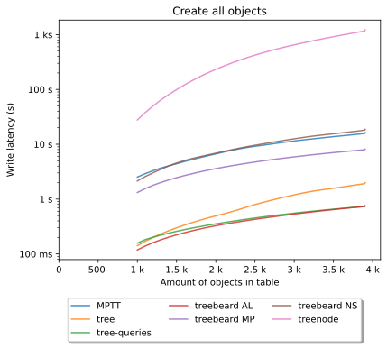
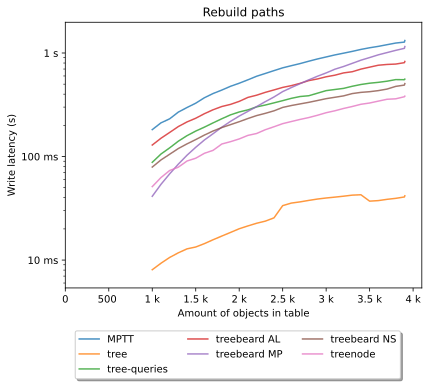
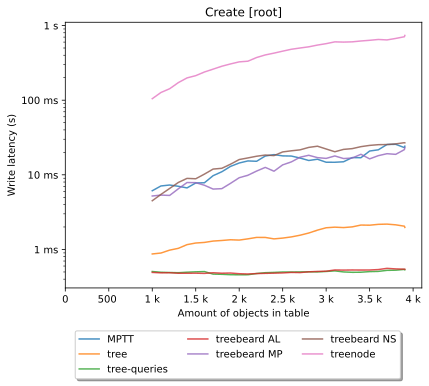

# Django-tree

## ⚠ Open to financing MySQL & SQLite compatibility ⚠

Fast and easy tree structures.

[](https://pypi.python.org/pypi/django-tree) [](https://github.com/BertrandBordage/django-tree/actions/workflows/ci.yml) [](https://codecov.io/gh/BertrandBordage/django-tree)

**In beta, it can’t be used yet in production.**

django-tree solves the same problem as **django-treebeard**, **django-mptt**
and **django-treenode**: storing and querying tree (hierarchy) structures with
Django. It does it differently: you add a `PathField` to an ordinary model
with a self-referencing `ForeignKey`, and the hierarchy is maintained
**inside PostgreSQL by a trigger** — not in Python. There is no model, manager
or queryset to subclass; an optional `TreeModelMixin` only adds convenience
methods (`get_descendants()`, `get_ancestors()`, …). Because the logic lives in
the database, bulk operations, `QuerySet.update()` and raw SQL all keep the tree
consistent.


## Comparison

> [!NOTE]
> django-treebeard ships three algorithms — **MP** (materialized path),
> **NS** (nested sets) and **AL** (adjacency list). MP is by far the most used,
> so its column shows the tick/cross and the figure for MP, with NS/AL noted
> underneath when they differ.

| | django-tree | [django-treebeard](https://github.com/django-treebeard/django-treebeard) | [django-mptt](https://github.com/django-mptt/django-mptt) | [django-treenode](https://github.com/fabiocaccamo/django-treenode) |
|---|:---:|:---:|:---:|:---:|
| **Works on any Django database** | ❌ PostgreSQL only | ✅ | ✅ | ✅ |
| **Drop-in (no model/manager subclassing)** | ✅ add one field | ❌ subclass `MP_Node`<br>_NS/AL: same_ | ❌ subclass `MPTTModel` | ❌ subclass `TreeNodeModel` |
| **Tree kept correct by the database** | ✅ SQL trigger | ❌ in Python<br>_AL: only a `parent` FK_ | ❌ in Python | ❌ in Python + cache |
| **Survives bulk writes / `update()` / raw SQL** | ✅ | ❌ Python API only<br>_AL: structure only_ | ❌ | ❌ manual resync |
| **Fast reads** | ✅ [\*](#bench) | ✅ MP fast [\*](#bench)<br>_NS ok, AL slow_ | 🟡 ok [\*](#bench) | ✅ cached [\*](#bench) |
| **Fast writes (insert / move)** | ✅ [\*](#bench) | 🟡 MP ok [\*](#bench)<br>_AL fast, NS slow_ | ❌ slow [\*](#bench) | ❌ recomputes cache [\*](#bench) |
| **Low storage overhead** | 🟡 tunable indexes [\*](#bench) | ❌ MP path strings [\*](#bench)<br>_AL tiny, NS medium_ | 🟡 4 columns [\*](#bench) | ❌ many cached fields [\*](#bench) |
| **Actively maintained** | 🟡 beta | ✅ | ❌ unmaintained | ✅ |

✅ yes / good · 🟡 partial or depends on the variant · ❌ no / poor.

<a id="bench"></a>
\* Performance ratings come from [our benchmark against the other
libraries](benchmark/results/results.md) (django-treenode is not included; its
profile — very fast cached reads, heavy writes — is taken from its design).

In short:

- **django-tree** is the only one that keeps the tree correct in the database
  itself, so bulk operations, `update()` and raw SQL stay safe — at the cost of
  being PostgreSQL-only.
- **treebeard** in its usual MP form reads fast and is well maintained, but
  enforces no database constraint and only stays correct through its Python API
  (its AL/NS variants trade read for write speed).
- **MPTT** stores the tree safely but writes get very slow on large or
  write-heavy tables and need periodic rebuilds. No longer maintained.
- **treenode** caches everything for very fast reads, but every write
  recomputes those caches and bulk writes need a manual resync.


## Benchmark

[The detailed benchmark](benchmark/results/results.md) gives a good idea
on how well django-tree performs compared to other Django solutions.
All that while being simpler to use, more robust and fully generalized to raw SQL, bulk etc.

A few noteworthy extracts of the benchmark (less is better):






## Installation

Django-tree requires Django 4.2+ and Python 3.10+, and runs on PostgreSQL
only. Support for other databases is open work (see the note at the top).

After installing the module, you need to add `'tree',` to your
`INSTALLED_APPS`, then add a `PathField` to a model with a
`ForeignKey('self')`, typically named `parent` (use the `parent_field`
argument of `CreateTreeTrigger` if the field has another name).
`PathField` stores `Path` objects which have methods to execute queries,
such as getting all the descendants of the current object, its siblings, etc.
To call these methods more conveniently, you can add `TreeModelMixin`
to your model.  The inheriting order is not important, as the mixin methods
do not clash with Django.  If you have multiple `PathField`
on the same model, you will have to specify the field name in the method
you’re calling using `path_field`.

This should give you a model like this:

```python
from django.db.models import Model, CharField, ForeignKey, BooleanField
from tree.fields import PathField
from tree.models import TreeModelMixin

class YourModel(Model, TreeModelMixin):
    name = CharField(max_length=30)
    parent = ForeignKey('self', null=True, blank=True)
    path = PathField()
    public = BooleanField(default=False)

    class Meta:
        ordering = ['path']
```

Then you need to create the SQL trigger that will automatically update `path`.
To do that, create a migration with a dependency
to the latest django-tree migration and add a `CreateTreeTrigger` operation:

```python
from django.db import migrations
from tree.operations import CreateTreeTrigger

class Migration(migrations.Migration):
    dependencies = [
        ('tree', '0001_initial'),
    ]

    operations = [
        CreateTreeTrigger('your_app.YourModel'),
    ]
```

If you already have data in `YourModel`, you will need to add an operation
for allowing SQL `NULL` values before creating the trigger,
then rebuild the paths and revert the allowance of `NULL` values:

```python
from django.db import migrations
from tree.fields import PathField
from tree.operations import CreateTreeTrigger, RebuildPaths

class Migration(migrations.Migration):
    dependencies = [
        ('tree', '0001_initial'),
    ]

    operations = [
        migrations.AlterField('YourModel', 'path', PathField(null=True)),
        CreateTreeTrigger('YourModel'),
        RebuildPaths('YourModel', 'path'),
        migrations.AlterField('YourModel', 'path', PathField()),
    ]
```

However, the model above is not ordered. The children of a same parent will be
ordered by primary key. You can specify how children are ordered using the
`order_by` argument of `PathField`. If needed, you can add a field
for users to explicitly order these objects, typically a position field.
Example model:

```python
from django.db.models import (
    Model, CharField, ForeignKey, IntegerField, BooleanField)
from tree.fields import PathField
from tree.models import TreeModelMixin

class YourModel(Model, TreeModelMixin):
    name = CharField(max_length=30)
    parent = ForeignKey('self', null=True, blank=True)
    position = IntegerField(default=1)
    path = PathField(order_by=['position', 'name'])
    public = BooleanField(default=False)

    class Meta:
        ordering = ['path']
```

And the corresponding migration:

```python
    from django.db import models, migrations
    from tree.operations import CreateTreeTrigger

    class Migration(migrations.Migration):
        dependencies = [
            ('tree', '0001_initial'),
        ]

        operations = [
            migrations.AddField('YourModel', 'position',
                                models.IntegerField(default=1))
            CreateTreeTrigger('YourModel'),
        ]
```

Here, the children of a same parent will be ordered by position, and then
by name if the position is the same.

> [!NOTE]
> You can also use `PathField` without adding a `CreateTreeTrigger`
> operation. However, the field will not automatically be updated, you
> will have to do it by yourself. In most cases this is not useful, so you
> should not use `PathField` without `CreateTreeTrigger` unless you know
> what you are doing.


## Usage

`PathField` is automatically filled thanks to `CreateTreeTrigger`,
you don’t need to set, modify, or even see its value once it is installed.
But you can use the `Path` object it stores or the more convenient
`TreeModelMixin` to get tree information about the current instance,
or make complex queries on the whole tree structure.
Example to show you most of the possibilities:

```python
obj = YourModel.objects.all()[0]
obj.path.get_level()
obj.get_level()  # Shortcut for the previous method, if you use
                    # `TreeModelMixin`. Same for other object methods below.
obj.is_root()
obj.is_leaf()
obj.get_children()
obj.get_children().filter(public=True)
obj.get_ancestors()
obj.get_ancestors(include_self=True)
obj.get_descendants(include_self=True)
obj.get_siblings()
obj.get_prev_sibling()  # Fetches the previous sibling.
obj.get_next_sibling()
# Same as `get_prev_sibling`, except that we get the first public one.
obj.get_prev_siblings().filter(public=True).first()
other = YourModel.objects.all()[1]
obj.is_ancestor_of(other)
obj.is_descendant_of(other, include_self=True)
YourModel.objects.filter_roots()

#
# Advanced usage
# Use the following methods only if you understand exactly what they mean.
#

YourModel.rebuild_paths()  # Rebuilds all paths of this field, useful only
                            # if something is broken, which shouldn’t happen.
YourModel.disable_tree_trigger()  # Disables the SQL trigger.
YourModel.enable_tree_trigger()   # Restores the SQL trigger.
with YourModel.disabled_tree_trigger():
    # What happens inside this context manager is ignored
    # by the SQL trigger.
    # The trigger is restored after that, even if an error occurred.
    pass
```

There is also a bunch of less useful lookups and transforms
available. They will be documented with examples in the future.


## Differences with MPTT and treebeard

### Level vs depth

django-mptt and django-treebeard use two different names to designate almost
the same thing: MPTT uses level and treebeard uses depth.
Both are integers to show how much distant is a node from the top of the tree.
The only difference is that level should start by convention with 1 and depth
should start with 0.

Unfortunately, **both MPTT and treebeard are wrong about the indexing**:
MPTT starts its level with 0 and treebeard starts its depth with 1.

**Django-tree finally fixes this issue by implementing a level starting by 1**,
and no depth to avoid confusion. One name had to be chosen, and I find that
“level” represents more accurately the idea that we deal with an abstract tree,
where all the node of the same level are on the same row.
In comparison, “depth” sounds like we’re actually digging a real root,
and it gives the impression that a child of a root
can be at a different depth than a child of another root, like in real life.


## Development

To run the `run_tests.py` and `run_benchmark.py` scripts:
- Make sure you have `uv` installed
- `uv sync --group benchmark`
- `docker run --rm -e POSTGRES_DB=tree -e POSTGRES_USER=tree -e POSTGRES_PASSWORD=test-only -p 5432:5432 postgres:latest -d`
- `uv run run_tests.py` to run regression tests
- `uv run run_benchmark.py` to run the full benchmark against other tree solutions (very long)
