# Summary

Take this summary with a mountain of salt. The [table of stats](stats.html) reports
**absolute** numbers on the largest tree measured (3905 rows). Every test runs on
every implementation — those without a native method use a simple, unofficial ORM
equivalent — so the whole grid is comparable. For each timing category it gives
three figures per implementation — the **best**, **typical** (geometric mean) and
**worst** single test — plus a single storage figure. Each cell carries the rank in
its row (two results within 5 % share a rank) and a severity marker based on
absolute latency, the same for reads and writes: laggy above 3 ms, very laggy above
100 ms, horrible above 1 s.

The worst-case rows are where deal-breakers show up. django-treenode rebuilds the
whole tree in Python on every write, so its worst write is ~25 minutes — and its
worst *read* balloons to ~5 minutes too, since it has no set-level descendants query
and the unofficial equivalent walks the tree node by node. treebeard NS and MPTT
reach ~19–22 s on their worst write. The adjacency-based readers (treebeard AL,
django-tree-queries) climb to ~0.6–0.9 s on the heaviest read traversal, where
django-tree stays at ~71 ms.

Note as well that despite django-tree being middle-of-the-pack on storage, it is
absolutely not a deal breaker — and the amount of indexes is a per-field parameter
that can be tuned down.

[Table of stats](stats.html)

## Legend

- **MPTT**: stores a `parent` foreign key and `left`, `right`, `tree_id` & `level` fields to represent the node position in the tree.
  Can be very slow at writing data, which can be blocking for a table of > 100 000 rows as you need to rebuild it from time to time. The only alternative to django-tree where tree structures are safely stored.
- **treebeard AL**: Adjacency List. Very basic, stores a foreign key only.
  Very fast to write, extremely slow to read.
- **treebeard MP**: Materialized Path. Stores the position in the tree
  using a string in the form `000100010002` for the equivalent to `[0, 0, 1]`
  in django-tree. Very fast for reading, good at writing, but very brittle: works only using
  an annoying Python API and enforces no database constraint.
- **treebeard NS**: Nested Sets. Equivalent to MPTT, but without a parent foreign key. As slow as MPTT and as brittle as treebeard MP.
- **treenode**: stores a `tn_parent` foreign key plus denormalized columns (ancestors, descendants, children & siblings pks/counts, level, order, …) that are recomputed in Python for the whole table on every write. Extremely fast to read since everything is precomputed, but writes get slower as the table grows because each one rebuilds the entire tree.
- **tree-queries**: stores nothing but a `parent` foreign key (a plain adjacency list, like treebeard AL) and resolves the hierarchy on demand with a recursive SQL CTE. Tiny on disk and very fast to write, with no Python tree API to maintain; reads pay the cost of the recursive query.

# Table disk usage

.svg)

# Rebuild paths

# Create

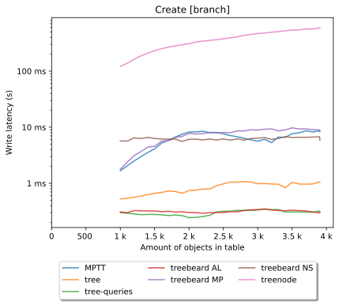
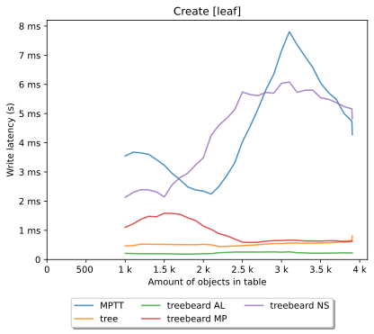

# Move

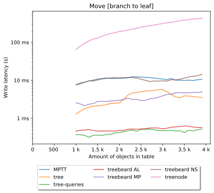
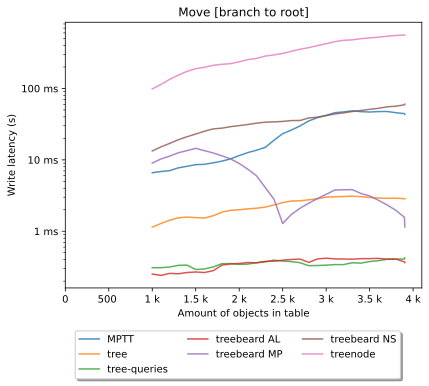
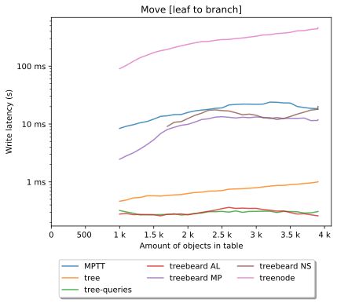
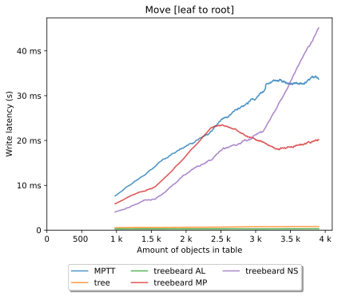
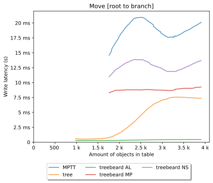
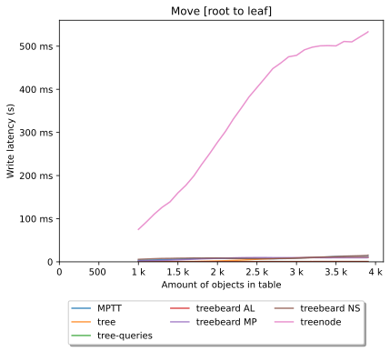
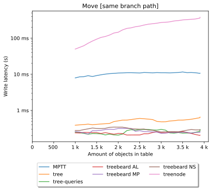
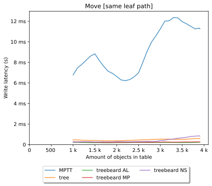
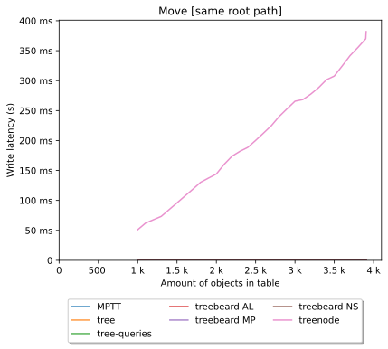

# Save without change (to data relevant to the order)

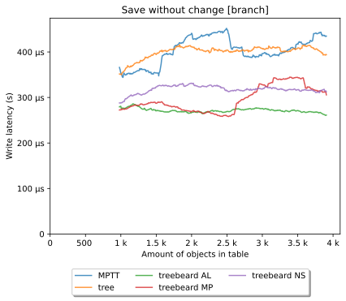
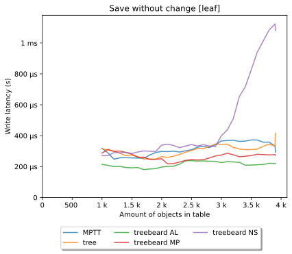
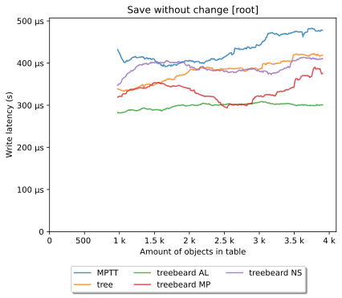

# Delete

Note that deleting with django-tree, treebeard AL and MPTT is slower than MP and NS due to Django itself.
Since these 3 implementations rely on a `ForeignKey` usually with `on_delete=CASCADE`,
the `Collector` from Django tries to find related data through these foreign keys,
even though we already send all descendants of the deleted node to Django.
The only way to speed this up would be to specify `DO_NOTHING`, but that
would be misleading since the descendants are still getting deleted.

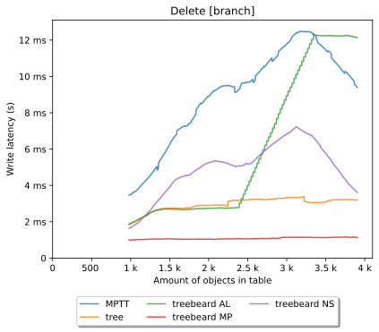
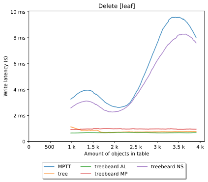
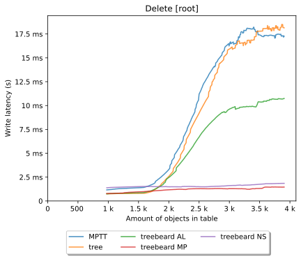

# Get roots

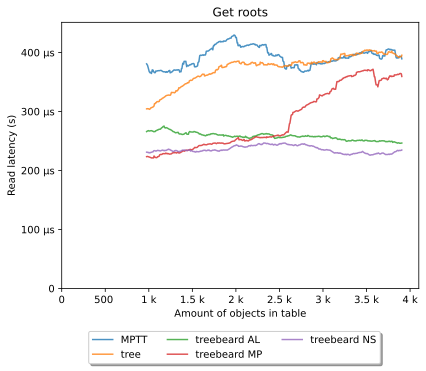

# Get ancestors

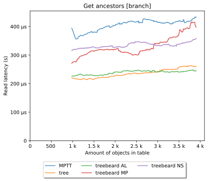
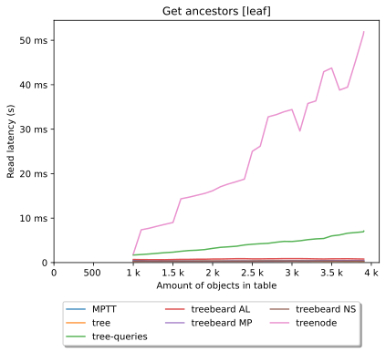
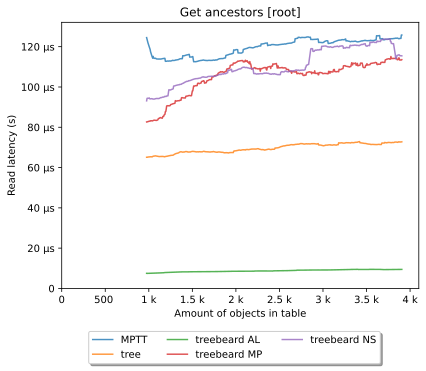

# Get siblings

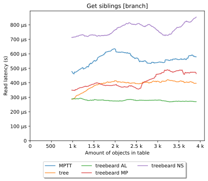
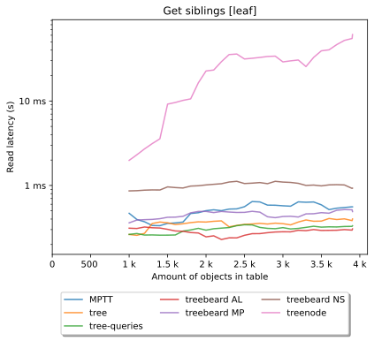
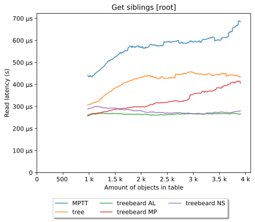

# Get previous sibling

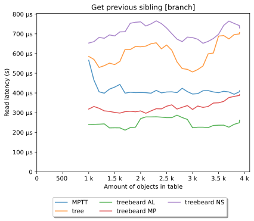
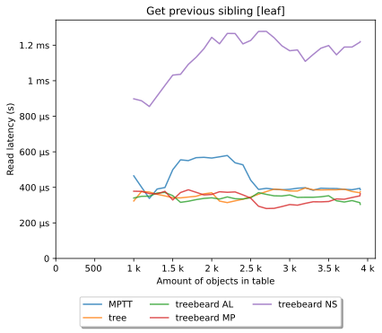
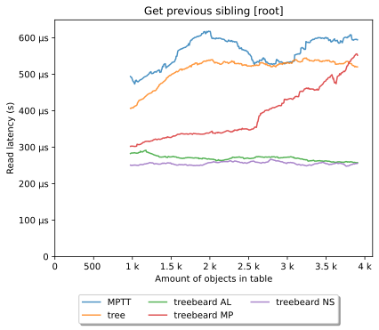

# Get next sibling

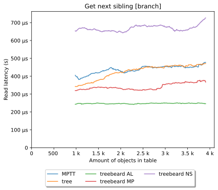
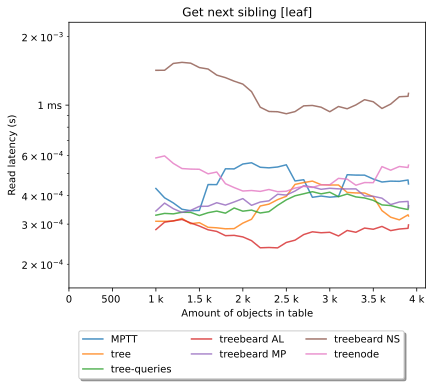
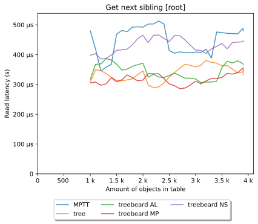

# Get children

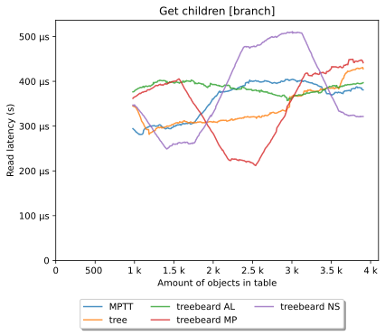
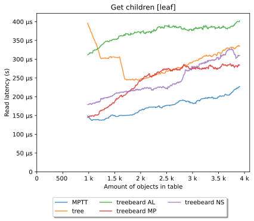
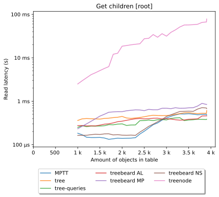

# Get children count

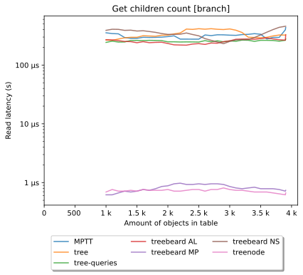
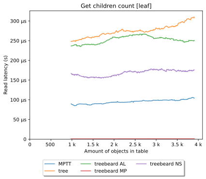
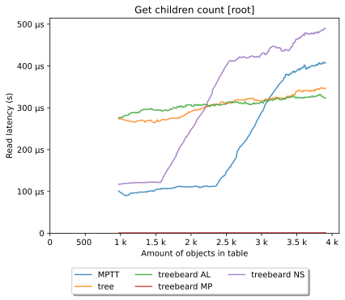

# Get filtered children count

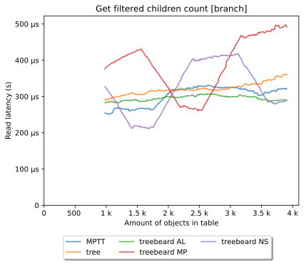
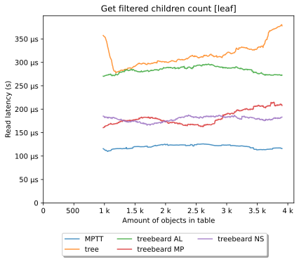
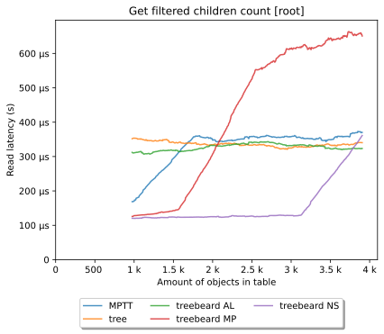

# Get descendants

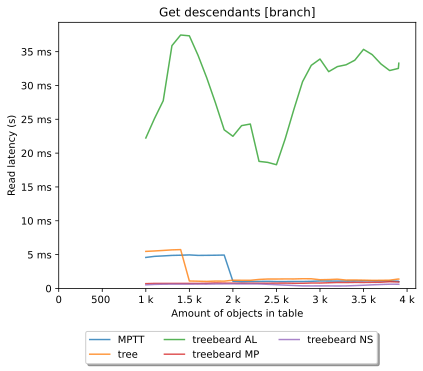
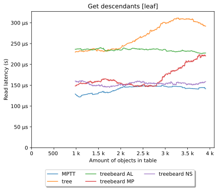
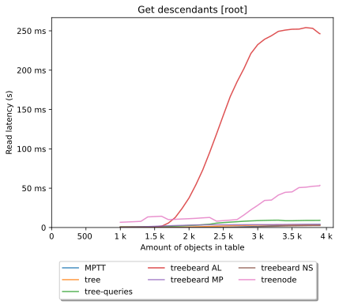
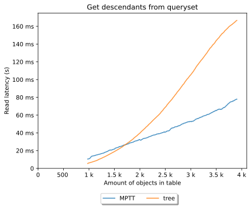

# Get descendants count

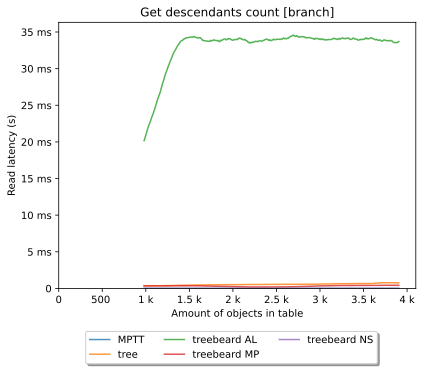
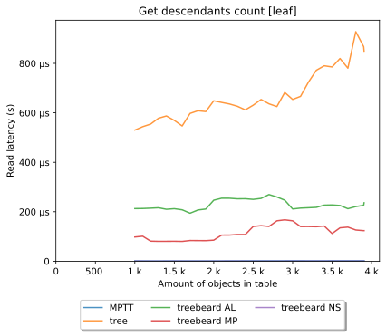
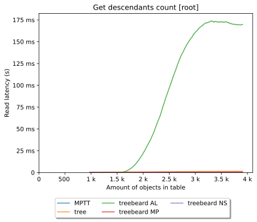

# Get filtered descendants count

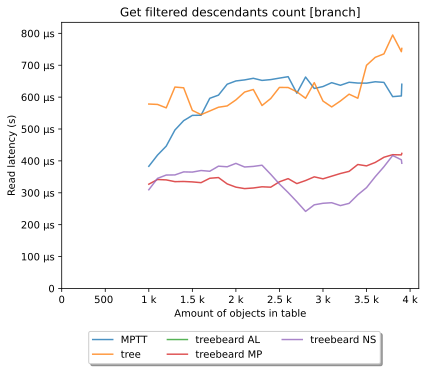
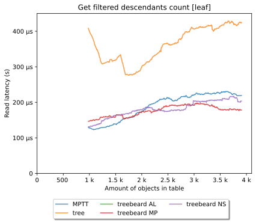
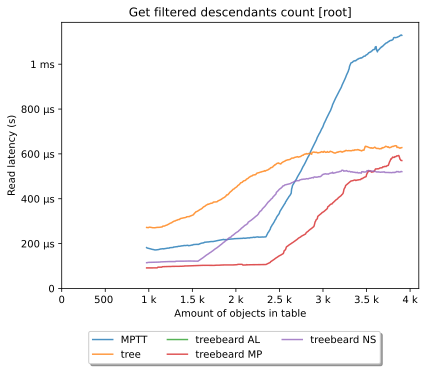
