# Summary

Take this summary with a mountain of salt, the grades are based on
how each implementation is performing relative to the others, test by test.
It does not take into account that some implementations have deal-breaker performance.

For example, most reads are too slow with treebeard AL to make it a serious choice for anything other than a toy project.

In the same way, MPTT can be extremely slow at writing data, making it unusable on a wide range of projects.

Note as well that despite the extremely low grade of django-tree in terms of storage,
it is absolutely not a deal breaker. By the way, the amount of indexes from django-tree
is based on a parameter that can be customized field by field.

[Table of stats](stats.html)

## Legend

- **MPTT**: stores a `parent` foreign key and `left`, `right`, `tree_id` & `level` fields to represent the node position in the tree.
  Can be very slow at writing data, which can be blocking for a table of > 100 000 rows as you need to rebuild it from time to time. The only alternative to django-tree where tree structures are safely stored.
- **treebeard AL**: Adjacency List. Very basic, stores a foreign key only.
  Very fast to write, extremely slow to read.
- **treebeard MP**: Materialized Path. Stores the position in the tree
  using a string in the form `000100010002` for the equivalent to `[0, 0, 1]`
  in django-tree. Very fast for reading, good at writing, but very brittle: works only using
  an annoying Python API and enforces no database constraint.
- **treebeard NS**: Nested Sets. Equivalent to MPTT, but without a parent foreign key. As slow as MPTT and as brittle as treebeard MP.

# Table disk usage

.svg)

# Rebuild paths

# Create

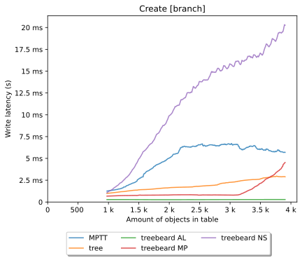
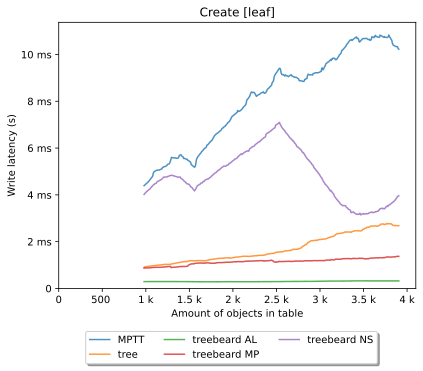
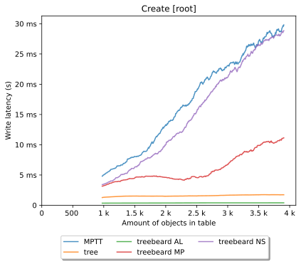
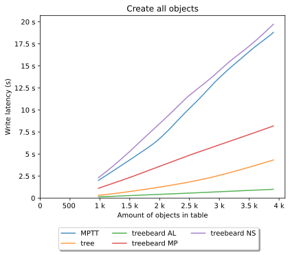

# Move

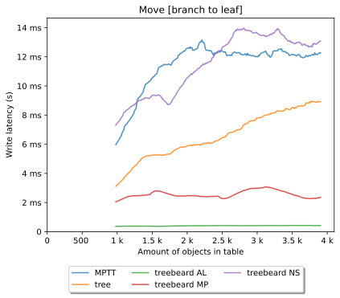
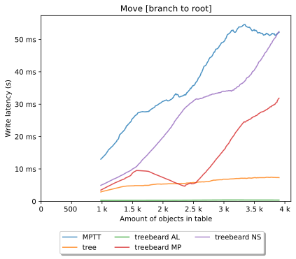
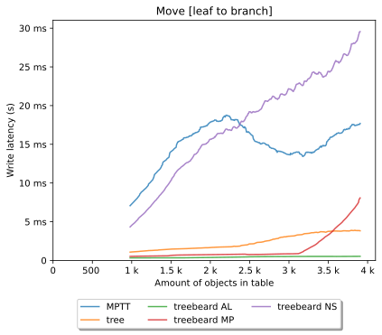
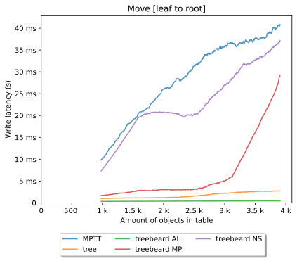
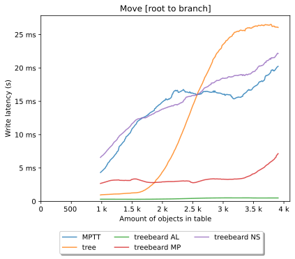
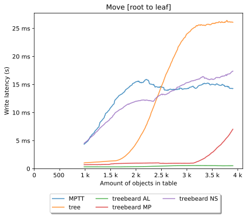

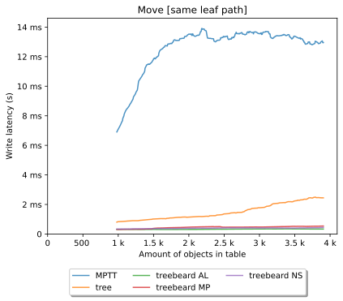
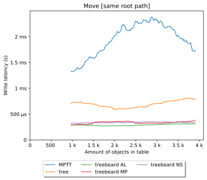

# Save without change (to data relevant to the order)

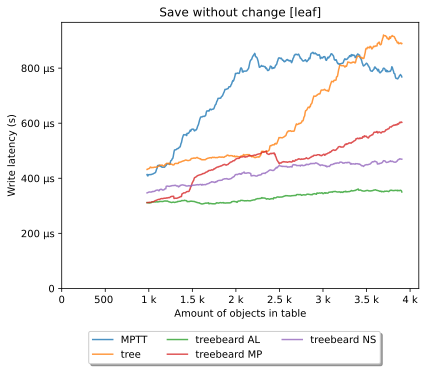
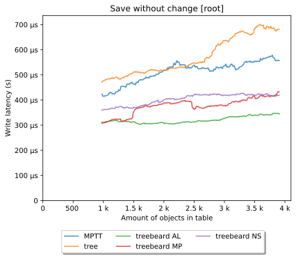

# Delete

Note that deleting with django-tree, treebeard AL and MPTT is slower than MP and NS due to Django itself.
Since these 3 implementations rely on a `ForeignKey` usually with `on_delete=CASCADE`,
the `Collector` from Django tries to find related data through these foreign keys,
even though we already send all descendants of the deleted node to Django.
The only way to speed this up would be to specify `DO_NOTHING`, but that
would be misleading since the descendants are still getting deleted.

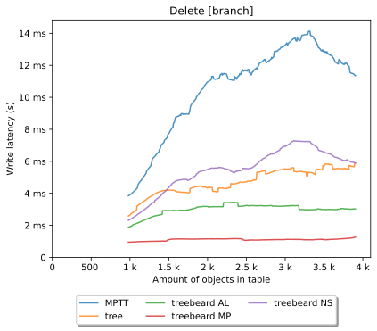

# Get roots

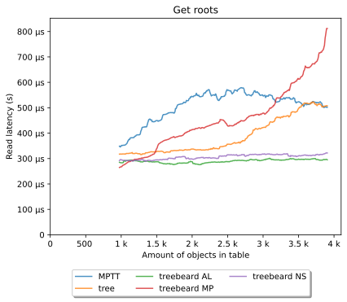

# Get ancestors

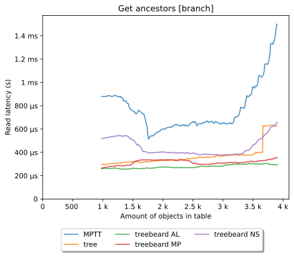

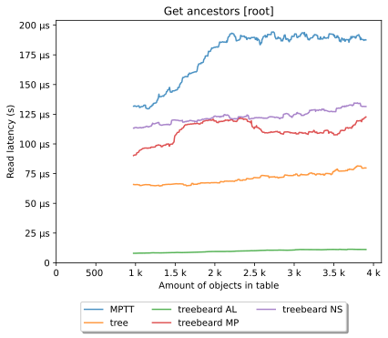

# Get siblings

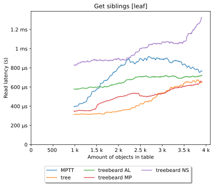
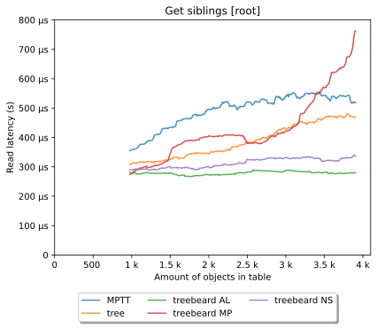

# Get previous sibling

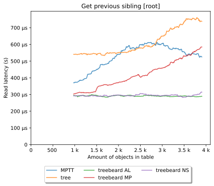

# Get next sibling

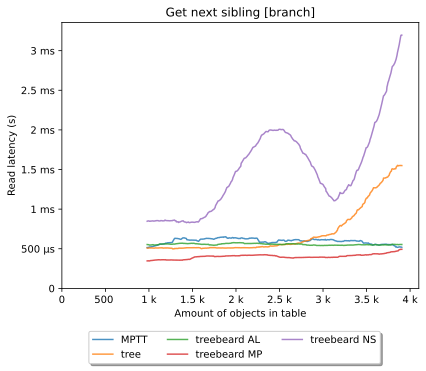
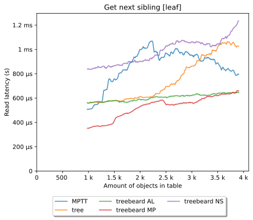
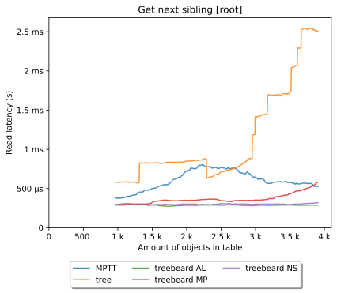

# Get children

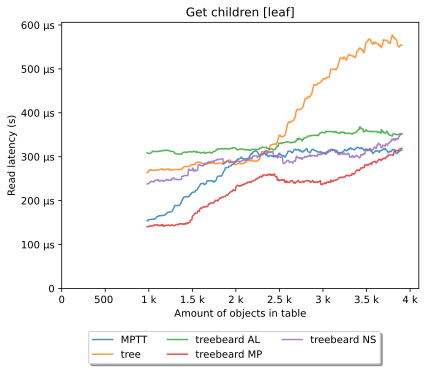

# Get children count

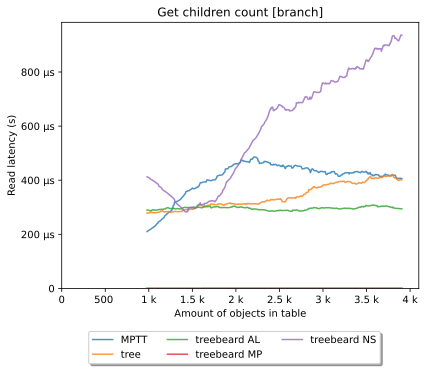
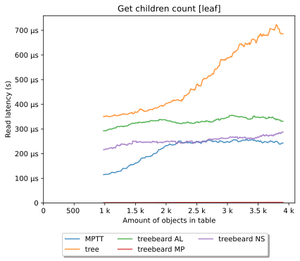

# Get filtered children count

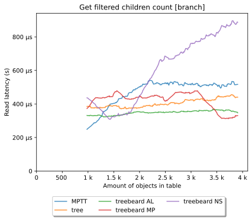

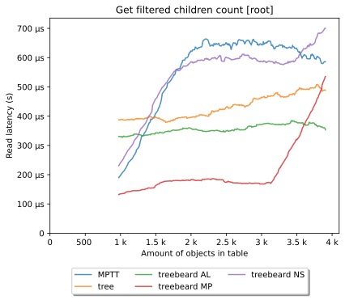

# Get descendants

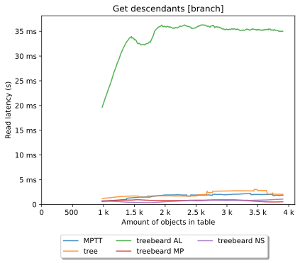

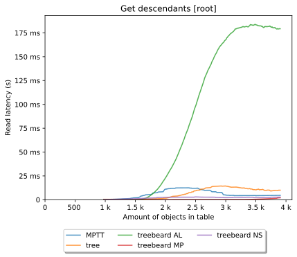
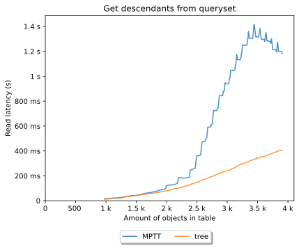

# Get descendants count

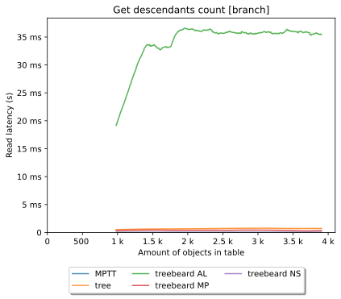
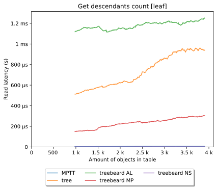

# Get filtered descendants count

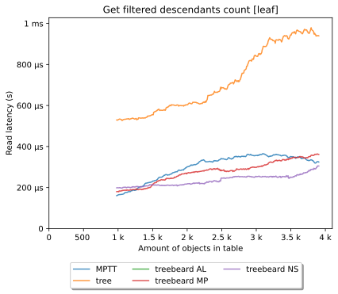
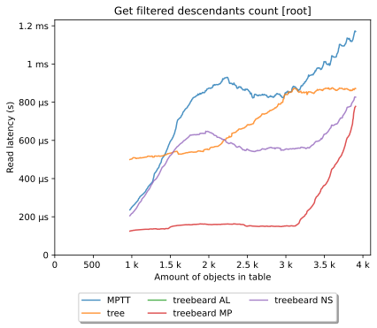
