Summary
=======

.. raw:: html
   :file: stats.html

Table disk usage
================

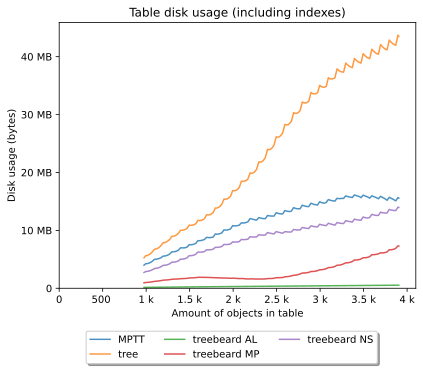

Rebuild paths
=============

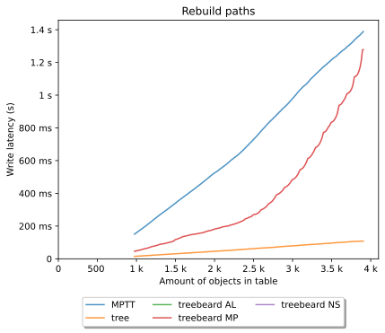

Create
======

.. image:: postgresql_-_Create_[branch].svg
.. image:: postgresql_-_Create_[leaf].svg
.. image:: postgresql_-_Create_[root].svg
.. image:: postgresql_-_Create_all_objects.svg

Move
====

.. image:: postgresql_-_Move_[branch_to_leaf].svg
.. image:: postgresql_-_Move_[branch_to_root].svg
.. image:: postgresql_-_Move_[leaf_to_branch].svg
.. image:: postgresql_-_Move_[leaf_to_root].svg
.. image:: postgresql_-_Move_[root_to_branch].svg
.. image:: postgresql_-_Move_[root_to_leaf].svg

Delete
======

.. image:: postgresql_-_Delete_[branch].svg
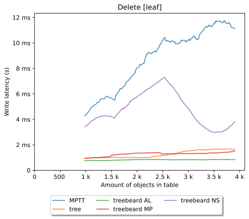
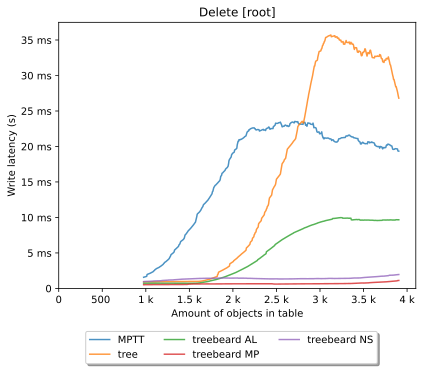

Get roots
=========

.. image:: postgresql_-_Get_roots.svg

Get ancestors
=============

.. image:: postgresql_-_Get_ancestors_[branch].svg
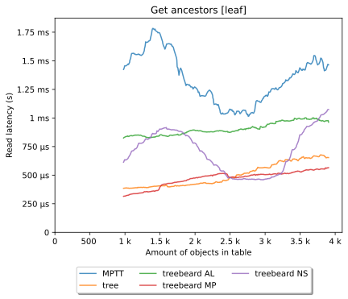
.. image:: postgresql_-_Get_ancestors_[root].svg

Get siblings
============

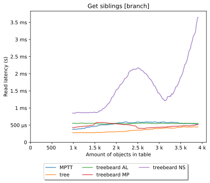
.. image:: postgresql_-_Get_siblings_[leaf].svg
.. image:: postgresql_-_Get_siblings_[root].svg

Get previous sibling
====================

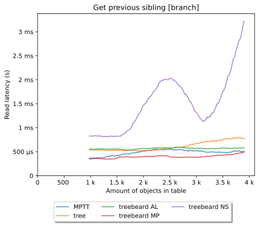
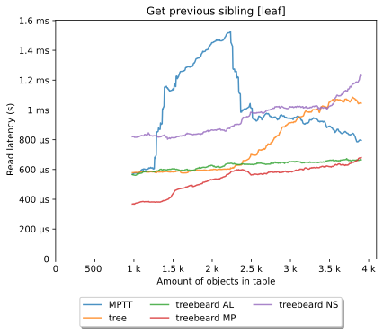
.. image:: postgresql_-_Get_previous_sibling_[root].svg

Get next sibling
================

.. image:: postgresql_-_Get_next_sibling_[branch].svg
.. image:: postgresql_-_Get_next_sibling_[leaf].svg
.. image:: postgresql_-_Get_next_sibling_[root].svg

Get children
============

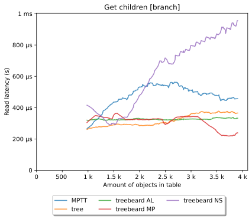
.. image:: postgresql_-_Get_children_[leaf].svg
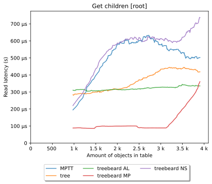

Get children count
==================

.. image:: postgresql_-_Get_children_count_[branch].svg
.. image:: postgresql_-_Get_children_count_[leaf].svg
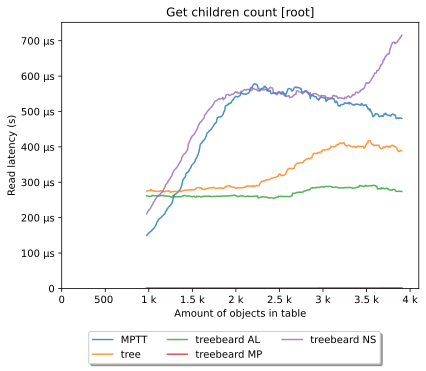

Get filtered children count
===========================

.. image:: postgresql_-_Get_filtered_children_count_[branch].svg
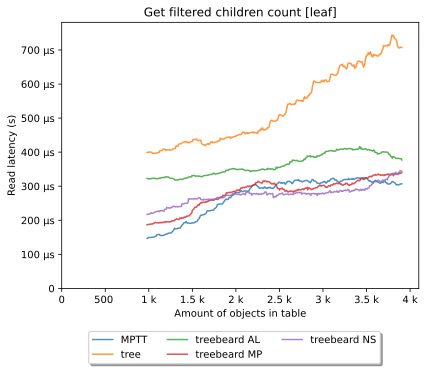
.. image:: postgresql_-_Get_filtered_children_count_[root].svg

Get descendants
===============

.. image:: postgresql_-_Get_descendants_[branch].svg
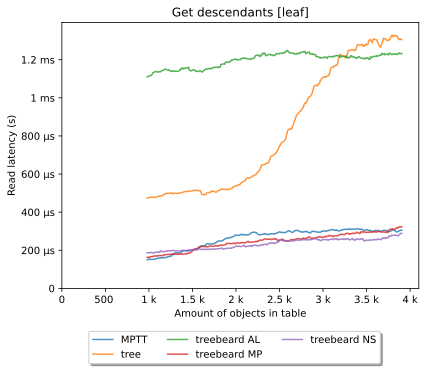
.. image:: postgresql_-_Get_descendants_[root].svg

Get descendants count
=====================

.. image:: postgresql_-_Get_descendants_count_[branch].svg
.. image:: postgresql_-_Get_descendants_count_[leaf].svg

Get filtered descendants count
==============================

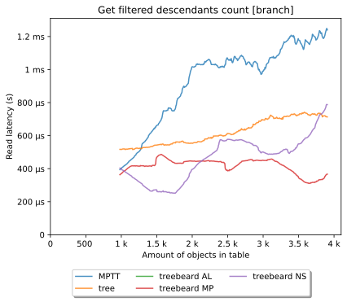
.. image:: postgresql_-_Get_filtered_descendants_count_[leaf].svg
.. image:: postgresql_-_Get_filtered_descendants_count_[root].svg
